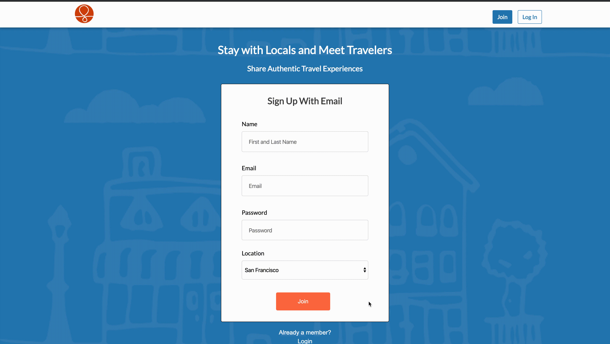

# CouchHopping

CouchHopping is a clone of Couchsurfing.com where users can hosts other users who are traveling to their cities or make requests to stay with them.

[Click Here to View Site](https://couchhopping.herokuapp.com/#/)

### Features


#### User Authentication



Users must be logined in to view content or use any features. This is acheived by creating a custom router that can be reused for multiple routes. New users are automatically logged in after creating an account.

```
const Protected = ({ component: Component, path, loggedIn, exact }) => (
    <Route path={path} exact={exact} render={(props) => (
        loggedIn ? (
            <Component {...props} />
        ) : (
                <Redirect to="/signup" />
            )
    )} />
);

export const ProtectedRoute = withRouter(connect(mapStateToProps)(Protected));

```

#### Respond to Requests


User's dashboard includes a to-Do list that lets users see any pending requests made to him or her. Clicking on the request toggles a flag in the local state to determine if the response form is shown or hidden, and custom CSS keyframe animation enhances the display of the response form.

```
.formOpen {
    animation: conditionalOpen 500ms normal forwards ease-in-out;
    -webkit-animation: conditionalOpen 500ms normal forwards ease-in-out;
    -moz-animation: conditionalOpen 500ms normal forwards ease-in-out;
    transform-origin: top;
}

@keyframes conditionalOpen {
    from { transform: scaleY(0) }
    to { transform: scaleY(1) }
}

...

```


#### Search


Users can search other users based on cities. A list of results dynamically adjusts to user's input. When user click on the search button or press the return key, the first result on the list is rendered.

```
<form 
    className="searchbar-right"
    onSubmit={() => this.handleSelectSearchResultItem(firstResult.id)}
>
    <input
        type="text"
        className="search-input"
        onChange={this.handleChange}
        placeholder="Where are you going?"
        value={this.state.query}
    />
    <ul className="search-result-list">
        {this.state.query.length === 0 ? "" : this.renderSearchResults()}
    </ul>
</form>

```

#### Booking


User can only make requests to users whose status is "Accepting Guests". A custom validation is made in the model to check if the arrival date comes before the departure date. The JavaScript library MomentJS is used to cleanly format dates and calculate the number of days between dates.

```
class DirectRequest < ApplicationRecord
    ...

    validate :start_must_come_before_end

    private

    def start_must_come_before_end
        return if start_date === nil || end_date === nil
        errors[:depature_date] << 'must come after arrival date' if start_date > end_date
    end
end

```
